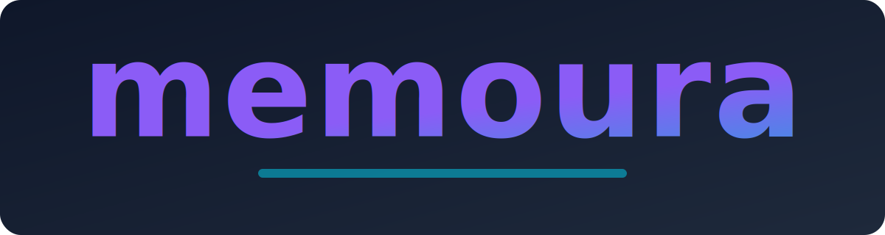

<p align="center">
  
</p>

# Memoura

A student-first note-taking and productivity app. Organize your notes, sync with Canvas courses, and plan your week—all in one desktop app.

Built with **Electron + React + Vite**

Link to video demo: https://drive.google.com/drive/folders/1s-gDN345HBq7WEGDQlwXGmNFc-gSz8wB?usp=share_link

---

## Features

- **Note Editor** — Create and edit notes in a clean, distraction-free interface
- **Markdown Support** — Write in Markdown with live preview for `.md` files
- **Organized Notes** — Browse and manage your note vault with a sidebar
- **Canvas Integration** — View your Canvas courses and assignments in a built-in calendar
- **Auto-save** — Changes are automatically saved as you edit
- **Dark Theme** — Eye friendly dark interface because everyone knows college students use their devices too much

---

## Requirements

To run Memoura locally, you WILL NEED:
- [Node.js](https://nodejs.org/) (v16+) — comes with `npm`
- [Git](https://git-scm.com/)
- [Ollama](https://ollama.com/) - required fore AI features
- A **Canvas API Key** (if you want to sync your school assignments).

**Supported Platforms:** macOS, Windows, Linux

---

## Setup & Development

### 1. Clone the Repository
```bash
git clone https://github.com/LeDuyNg/Memoura.git
cd Memoura
```

### 2. Install Dependencies
```bash
npm install
```

### 3. Configure Environment (NECESSARY STEP DO NOT SKIP)
Create a `.env` file in the project root to enable Canvas integration.

**How to get your Canvas API Key:**

1. Log in to your Canvas account.

2. Click on your Account icon in the sidebar -> Settings.

3. Scroll down to Approved Integrations and click the blue "+ New Access Token" button.

4. Generate the token and copy it immediately.

Create a file named .env in the root folder and paste your key:
```
CANVAS_API_KEY="your_api_key_here"
CANVAS_DOMAIN="https://sjsu.instructure.com"
```
### 4. Setup AI (Ollama)
Memoura uses a local LLM for privacy and speed
1. Download and install [Ollama](https://ollama.com/download).

2. Open your terminal and run the following command to download the `gemma3:1b model`:
```bash
ollama run gemma3:1b
```
(Ensure Ollama is running in the background while you use the app.)

### 5. Run Development Server
```bash
npm run dev
```
The app will open in an Electron window. Changes to source files will hot-reload.

---
## Building
This will be necessary if we ever acutally wish to ship this project out to other users:

```bash
# Build for macOS
npm run build:mac

# Build for Windows
npm run build:win

# Build for Linux
npm run build:linux
```

Built files will be in the `dist/` directory.

---

## Project Structure

```
src/
├── main/           # Electron main process (file I/O, IPC)
├── preload/        # Preload scripts (secure IPC)
└── renderer/       # React app (UI components)
    └── src/
        ├── components/
        │   ├── Dashboard.jsx    # Main view, file browser
        │   ├── Notepad.jsx      # Editor with Markdown preview
        │   ├── Calendar.jsx     # Canvas courses calendar
        │   └── Sidebar.jsx      # Navigation
        └── assets/
            └── main.css         # Global styles
```

---

## Commands that might be useful

- `npm run dev` — Start development server
- `npm run build` — Build the app
- `npm run preview` — Preview the built app
- `npm run lint` — Run ESLint
- `npm run format` — Format code with Prettier
