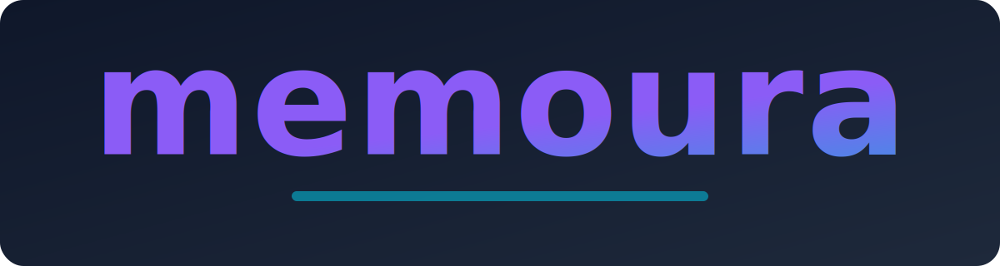

<p align="center">
  
</p>

# Memoura

A student-first note-taking and productivity app.  
Built with **Tauri + Vue**.

---

## Requirements
To run Memoura locally, you’ll need:
- [Node.js](https://nodejs.org/) — comes with `npm`
- [Git](https://git-scm.com/)
- [Rust](https://www.rust-lang.org/tools/install)
- Any text editor
- Works on: mac os, windows, or Linux


---

## Development

### Getting Started (for mac, windows, and linux)
```bash
# clone the repo
git clone https://github.com/LeDuyNg/Memoura.git

# make sure you are in the main folder and install dependencies
npm install       

# start the Tauri Application/Web Application
npm run tauri dev